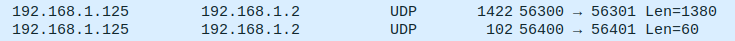

# MID360 ROS driver inside a Docker Container

Publish Point-Cloud and IMU data from a [Livox MID-360 LiDAR](https://www.livoxtech.com/mid-360) from a docker container.

## Quick Start

The following guide assumes you are using a Linux Device. This will also *likely not work in WSL2*.

### Host Network Setup

#### Create a Wired Connection

Create a new wired network connection with the settings described in the image below.


Make sure the LiDAR is connected, running and the connection is enabled. You do not need to disable the wireless network.

#### Allow incoming data

The `scripts/network` folder contains two scripts to enable or dislbe incoming connection from the LiDAR device.
Have a look at the QR code on the back of the device, below it you can find the Serial No., the **last two digits** of which you need to enter when running the script.

For example, if your device's no were to end with `99`, you'd run

```bash
./scripts/network/ufw_allow.sh 99
```

And run `ufw_reset.sh 99` to disable that same rule again. To make sure the rule exists or is deleted properly, the firewall status will be displayed as well.

#### Modify the Configuraiton Files

Now the same part of the LiDARs IP address needs to be set in the `mid360_runner/config/MID360_config.json` file,

```
{
  // other stuff can stay as is ...
  "lidar_configs" : [
    {
      "ip" : "192.168.1.1xx", // <- put your device digits here!
      "pcl_data_type" : 1,
      "pattern_mode" : 0,
      "extrinsic_parameter" : {
        "roll": 0.0,
        "pitch": 0.0,
        "yaw": 0.0,
        "x": 0,
        "y": 0,
        "z": 0
      }
    }
  ]
}
```

Make sure to leave the rest of the parameters as-is.
I have changed the host IP from `192.168.1.5` (default in the [original SDK settings](https://github.com/Livox-SDK/livox_ros_driver2/blob/master/config/MID360_config.json#L14)) to `.2` because when inspecting network traffic using [Wireshark](https://www.wireshark.org/), I saw that the LiDAR requires the host to be `192.168.1.2`!

### Build & Run the Container

```bash
./scripts/docker/build_image.sh
./scripts/docker/run_image.sh
```

Inside the container, you can then run one of the launch files in the `mid360_runner` package.

```bash
roslaunch mid360_runner <rviz_MID360.launch|msg_MID360.launch>
```

### Troubleshooting

If you run the launch files and no messages are published, you surely messed up at one of the steps above

- Is your host IP `192.168.1.2`, your netmask `255.255.255.0` and your gateway `192.168.1.1`?
- Did you allow incoming network traffic? Is the device Serial No. entered correctly?
- Make sure the LiDAR is sending data by running Wireshark.

The packets should look something like this, where the first message is point cloud data and the second one is IMU data.



- optionally, make sure the Ports are correct (they were correct by default in my case).

## Configuring the PointCloud Format

The default way to store point clouds uses the `sensor_msgs/PointCloud2` message type. However, `livox_ros_driver2` provides an additional format called `CustomMsg` and `CustomPoint`, which also contain the exact time-offset at which the point was recorded.

There are packages such as [FAST-LIO](https://github.com/hku-mars/FAST_LIO), which use this message type instead of `sensor_msgs/PointCloud2`.

To configure the driver node to publish a `CustomMsg` point cloud message, you can run

```bash
roslaunch mid360_runner msg_MID360.launch xfer_format:=1
```

Note that if you set `xfer_format:=1` in `rviz_MID360.launch`, RViz will not be able to display the point cloud.